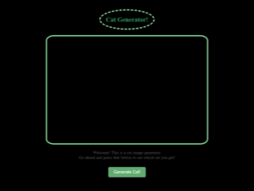

## Credits

This project uses [TheCatAPI](https://thecatapi.com/) for fetching cat images.  
Please visit their website for more information or to get your own API key.

---

**For educational and demo purposes only.**

---

 
 

Here you'll find how to fetch and work with fetched data. Check out the `script.js` file.

Here's the web page preview:

